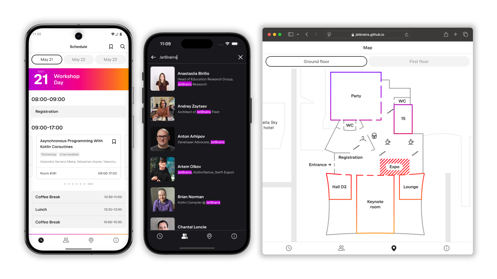

 

# KotlinConf App

This repository contains the source code of the official application for [KotlinConf](https://kotlinconf.com/).

The application is written in Kotlin, sharing code between all of its platforms using [Kotlin Multiplatform](https://www.jetbrains.com/kotlin-multiplatform/).

* The client application for Android, iOS, desktop, and web is built with shared UI using [Compose Multiplatform](https://www.jetbrains.com/compose-multiplatform/).
* The backend application is powered by the [Ktor](https://ktor.io/) server-side framework and the [Exposed](https://www.jetbrains.com/help/exposed/home.html) database library.

The app is published for the following platforms:

* Android: [available on Google Play](https://play.google.com/store/apps/details?id=com.jetbrains.kotlinconf)
* iOS: [available from the App Store](https://apps.apple.com/us/app/kotlinconf/id1299196584)
* Web: [deployed to GitHub Pages](https://jetbrains.github.io/kotlinconf-app/)

## Building the project

To build the project locally:

1. [Set up your environment](https://www.jetbrains.com/help/kotlin-multiplatform-dev/multiplatform-setup.html) for Kotlin Multiplatform development.
2. Open the project in IntelliJ IDEA or Android Studio.
3. Run the desired platform
   * Android: use the `androidApp` run configuration
   * iOS: use `KotlinConfAppScheme`
   * Desktop: `./gradlew :shared:jvmRunHot -DmainClass=org.jetbrains.kotlinconf.MainKt`
   * Web: `./gradlew :shared:wasmJsBrowserDevelopmentRun `
   * Backend: `./gradlew :backend:run`
