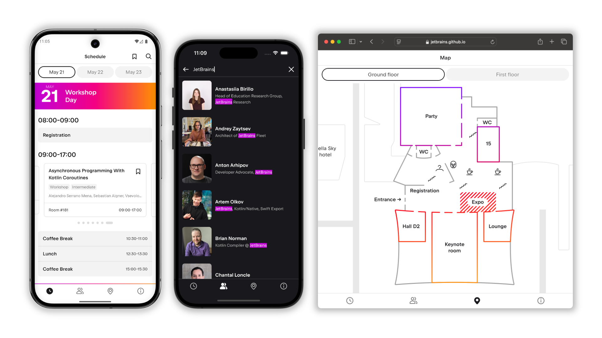

[](https://confluence.jetbrains.com/display/ALL/JetBrains+on+GitHub) 

# KotlinConf App

This repository contains the source code of the official application for [KotlinConf](https://kotlinconf.com/).

> KotlinConf 2026 tickets are currently on sale! Visit the [Registration](https://kotlinconf.com/registration/) page of the website to grab yours.



The application is written in Kotlin, sharing code between all of its platforms using [Kotlin Multiplatform](https://www.jetbrains.com/kotlin-multiplatform/).

* The client application for Android, iOS, desktop, and web is built with shared UI using [Compose Multiplatform](https://www.jetbrains.com/compose-multiplatform/).
* The backend application is powered by the [Ktor](https://ktor.io/) server-side framework and the [Exposed](https://www.jetbrains.com/help/exposed/home.html) database library.

The app is published for the following platforms:

* Android: [available on Google Play](https://play.google.com/store/apps/details?id=com.jetbrains.kotlinconf)
* iOS: [available from the App Store](https://apps.apple.com/us/app/kotlinconf/id1299196584)
* Web: [deployed to GitHub Pages](https://jetbrains.github.io/kotlinconf-app/)

## Building the project

To build the project locally:

1. [Set up your environment](https://www.jetbrains.com/help/kotlin-multiplatform-dev/multiplatform-setup.html) for Kotlin Multiplatform development.
2. Open the project in IntelliJ IDEA or Android Studio.
3. Run the desired platform
   * Android: use the `androidApp` run configuration
   * iOS: use `iosApp`
   * Desktop: `Run Module desktopApp`
   * Web: not supported yet ([AMPER-258](https://youtrack.jetbrains.com/issue/AMPER-258))
   * Backend: `Run Module backend`
   * Or use `./kotlin run -m <name-of-the-module-mentioned-above>`

## Liquid Glass demo

The `kotlin-toolchain-nadc-lg` branch combines Kotlin Toolchain with the native iOS navigation from `lg-nav`.

With Xcode 26 or newer installed, build and run on an iOS 26+ simulator:

```bash
./kotlin build -m iosApp -p iosSimulatorArm64
./kotlin run -m iosApp -p iosSimulatorArm64
```

For Xcode, open `app/iosApp/module.xcworkspace` and select the `app` scheme.
Complete onboarding, then enable **System navigation** in the app settings to use the native Liquid Glass tabs and navigation. Older iOS versions use Compose navigation.
